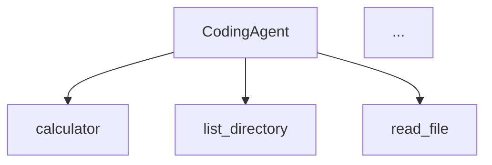

# CLI Usage Guide

The Coding Agent provides an interactive command-line interface for conversational coding assistance.

## Installation

```bash
# clone the repository
git clone https://github.com/your-repo/vanila-coding-agent.git
cd vanila-coding-agent

# install dependencies
uv sync
```

## Configuration

### API Keys

Set your LLM provider API key as an environment variable:

```bash
# OpenAI
export OPENAI_API_KEY="sk-..."

# Anthropic
export ANTHROPIC_API_KEY="sk-ant-..."

# Google
export GOOGLE_API_KEY="..."

# Together AI
export TOGETHER_API_KEY="..."
```

Or create a `.env` file in the project root:

```env
OPENAI_API_KEY=sk-...
ANTHROPIC_API_KEY=sk-ant-...
```

### Config File (Optional)

Create `config.yaml` for persistent settings:

```yaml
llm:
  provider: openai          # openai, anthropic, google, together
  model: gpt-4o             # model name (optional, uses provider default)
  temperature: 0.7          # optional
  max_tokens: 4096          # optional
```

## Basic Usage

### Start the Agent

```bash
# auto-detect provider based on available API keys
uv run python -m coding_agent.main

# specify provider
uv run python -m coding_agent.main --provider openai

# specify provider and model
uv run python -m coding_agent.main --provider anthropic --model claude-3-5-sonnet-20241022
```

### Interactive Session

Once started, you'll see a prompt where you can type messages:

```
Using provider: openai
You: Hello, can you help me write a Python function?

Agent: Of course! What would you like the function to do?

You: Write a function that calculates fibonacci numbers

Agent: Here's a function to calculate Fibonacci numbers:
...
```

### Exit the Session

Type `exit` or `quit` to end the session:

```
You: exit
Goodbye!
```

## Command Line Options

| Option | Description |
|--------|-------------|
| `--provider` | LLM provider (openai, anthropic, google, together) |
| `--model` | Model name (overrides config) |
| `--stream` | Enable streaming responses |
| `--verbose` | Show detailed output including reasoning |
| `--visualize` | Generate Mermaid diagram of agent structure |
| `--log-level` | Set log level (DEBUG, INFO, WARNING, ERROR) |

### Examples

```bash
# streaming mode (see responses as they're generated)
uv run python -m coding_agent.main --stream

# verbose mode (see tool execution details)
uv run python -m coding_agent.main --verbose

# both streaming and verbose
uv run python -m coding_agent.main --stream --verbose

# debug logging
uv run python -m coding_agent.main --log-level DEBUG
```

## Available Tools

The agent has access to these tools:

| Tool | Description |
|------|-------------|
| `calculator` | Basic math operations (+, -, *, /) |
| `list_directory` | List files in a directory |
| `read_file` | Read contents of a file |
| `write_file` | Write content to a file (requires confirmation) |
| `run_command` | Execute shell commands (requires confirmation) |
| `python_repl` | Execute Python code (requires confirmation) |
| `tavily_search` | Search the web (requires TAVILY_API_KEY) |
| `ask_user` | Ask clarifying questions |

## Confirmation Prompts

Dangerous operations require your confirmation:

```
You: Create a file called hello.py with a hello world program

[Confirm]: Write 45 characters to 'hello.py' (y/n): y

Executing tool: write_file with args: {'path': 'hello.py', 'content': '...'}
Agent: I've created hello.py with a simple hello world program.
```

To reject an operation, type `n`:

```
[Confirm]: Execute command: 'rm -rf temp/' (y/n): n

Agent: I understand. The operation was cancelled.
```

## Interrupt Handling

If the agent needs clarification, it will ask:

```
You: Write a sorting function

[Agent asks]: What type of data should the function sort? (numbers, strings, objects)
Your answer: numbers

Agent: Here's a function to sort numbers:
...
```

## Auto-Approve Patterns

You can configure patterns to auto-approve certain operations in `config.yaml`:

```yaml
auto_approve:
  write:
    - "tests/*"      # auto-approve writes to tests directory
    - "*.log"        # auto-approve log files
  execute:
    - "ls"           # auto-approve ls command
    - "pwd"          # auto-approve pwd command
    - "git status"   # auto-approve git status
```

## Visualizing the Agent

Generate a Mermaid diagram of the agent structure:

```bash
uv run python -m coding_agent.main --visualize
```

Output:


## Environment Variables

| Variable | Description |
|----------|-------------|
| `LLM_PROVIDER` | Default provider |
| `OPENAI_API_KEY` | OpenAI API key |
| `ANTHROPIC_API_KEY` | Anthropic API key |
| `GOOGLE_API_KEY` | Google AI API key |
| `TOGETHER_API_KEY` | Together AI API key |
| `TAVILY_API_KEY` | Tavily search API key |
| `CODING_AGENT_LOG_LEVEL` | Log level (DEBUG, INFO, WARNING, ERROR) |

## Troubleshooting

### "No LLM provider specified"

Set an API key environment variable or specify `--provider`:

```bash
export OPENAI_API_KEY="sk-..."
# or
uv run python -m coding_agent.main --provider openai
```

### "Authentication error"

Check that your API key is valid and has sufficient credits.

### Tool execution fails

- **File operations**: Check file permissions and path validity
- **Commands**: Some commands are blocked for security (rm, sudo, etc.)
- **Python REPL**: Some imports are blocked (os, subprocess, etc.)

### Streaming not working

Some providers may not support streaming. Try without `--stream`:

```bash
uv run python -m coding_agent.main --provider together
```
