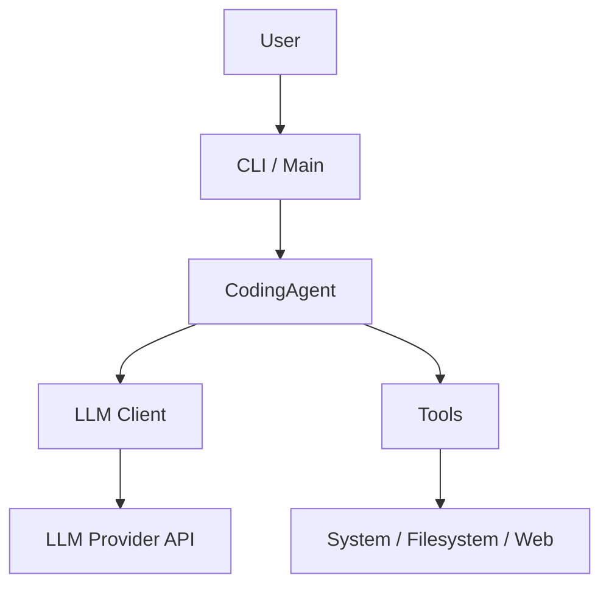

# Architecture Overview

The Coding Agent is designed with modularity and extensibility in mind. It follows a clean architecture pattern, separating the core agent logic from specific LLM implementations and tools.

## High-Level Structure

## Core Components

### 1. CodingAgent (`src/coding_agent/agent.py`)
The `CodingAgent` is the central orchestrator. It manages:
- **Conversation History**: Stores messages in a unified format.
- **Tool Execution Loop**: Handles the ReAct cycle (Think -> Act -> Observe).
- **Streaming**: Processes streaming responses from LLMs and handles partial tool calls.

### 2. LLM Clients (`src/coding_agent/clients/`)
All LLM providers implement the `BaseLLMClient` abstract base class. This ensures a consistent interface for the agent, regardless of the underlying provider.
- **BaseLLMClient**: Defines `generate` and `format_tools` methods.
- **Implementations**: `TogetherClient`, `OpenAIClient`, `AnthropicClient`, `GoogleClient`.
- **Unified Types**: All clients convert provider-specific responses into `UnifiedResponse` and `UnifiedMessage` objects.

### 3. Tools (`src/coding_agent/tools/`)
Tools are standalone classes inheriting from `BaseTool`.
- **BaseTool**: Defines the interface (`name`, `description`, `parameters`, `execute`).
- **Implementations**:
    - `CalculatorTool`: Basic arithmetic.
    - `ListDirectoryTool`, `ReadFileTool`, `WriteFileTool`: Filesystem operations.
    - `RunCommandTool`: Shell command execution.
    - `PythonREPLTool`: Python code execution.
    - `TavilySearchTool`: Web search.

### 4. Configuration
The system uses a layered configuration approach:
1.  **CLI Arguments**: Highest priority.
2.  **`config.yaml`**: User-defined configuration.
3.  **Environment Variables**: API keys and defaults.

## Data Flow

1.  **Input**: User provides input via CLI.
2.  **Processing**: `CodingAgent` constructs the prompt and sends it to the configured `LLM Client`.
3.  **Generation**: The LLM generates a response (text or tool call).
4.  **Action**:
    - If text: Displayed to the user.
    - If tool call: `CodingAgent` executes the tool and feeds the result back to the LLM.
5.  **Loop**: The process repeats until the LLM provides a final answer.
