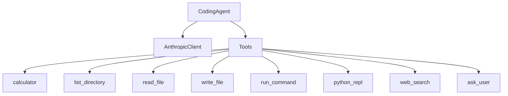

# Agent Architecture

This guide explains the core architecture of the Coding Agent, including the ReAct loop, state management, and message flow.

## Overview

The Coding Agent is built on the **ReAct** (Reasoning, Acting, Observing) paradigm. The agent:

1. **Reasons** about what to do next based on the conversation
2. **Acts** by calling tools or generating responses
3. **Observes** the results and loops back

```
┌─────────────────────────────────────────────────┐
│                  User Input                     │
└─────────────────────────────────────────────────┘
                       ↓
┌─────────────────────────────────────────────────┐
│              Add to History                     │
└─────────────────────────────────────────────────┘
                       ↓
┌─────────────────────────────────────────────────┐
│             ReAct Loop Start                    │
│  ┌─────────────────────────────────────────┐   │
│  │     1. Generate (LLM Call)              │   │
│  │        - Send history + tools           │   │
│  │        - Get response with tool_calls   │   │
│  └─────────────────────────────────────────┘   │
│                       ↓                         │
│  ┌─────────────────────────────────────────┐   │
│  │     2. Process Message                  │   │
│  │        - Has tool calls? Execute them   │   │
│  │        - No tool calls? Done!           │   │
│  └─────────────────────────────────────────┘   │
│                       ↓                         │
│           Loop until no tool calls              │
└─────────────────────────────────────────────────┘
                       ↓
┌─────────────────────────────────────────────────┐
│              AgentRunResult                     │
│   (COMPLETED | INTERRUPTED | AWAITING_CONFIRM)  │
└─────────────────────────────────────────────────┘
```

## Agent States

The agent can be in one of four states:

### COMPLETED

The agent has finished processing and returned a final response.

```python
result = agent.run("Hello!")
if result.is_completed:
    print(result.content)  # "Hello! How can I help you today?"
```

### INTERRUPTED

A tool (typically `AskUserTool`) needs user input before continuing.

```python
result = agent.run("Should I create a backup?")
if result.is_interrupted:
    print(result.interrupt.question)  # "Do you want me to create a backup?"
    # get user response and resume
    result = agent.resume(result.interrupt.tool_call_id, "Yes, please")
```

### AWAITING_CONFIRMATION

A dangerous operation (file write, command execution, code execution) needs user approval.

```python
result = agent.run("Delete all log files")
if result.is_awaiting_confirmation:
    print(result.confirmation.message)  # "Execute command: 'rm *.log'"
    # get user confirmation
    result = agent.resume_confirmation(
        result.confirmation.tool_call_id,
        confirmed=True  # or False to cancel
    )
```

### ERROR

An unrecoverable error occurred.

```python
if result.is_error:
    print(f"Error: {result.error}")
```

## Core Components

### CodingAgent

The main agent class that orchestrates everything:

```python
from coding_agent import CodingAgent
from coding_agent.clients import create_client
from coding_agent.tools import get_default_tools

# create components
client = create_client("anthropic")
tools = get_default_tools()

# create agent
agent = CodingAgent(
    client=client,
    tools=tools,
    system_prompt="You are a helpful coding assistant.",
    auto_approve_patterns={
        "write": ["tests/*"],      # auto-approve writes to tests/
        "execute": ["ls", "pwd"],  # auto-approve safe commands
    }
)
```

### Key Methods

| Method | Description |
|--------|-------------|
| `run(user_input, stream, verbose)` | Start a new conversation turn |
| `resume(tool_call_id, response)` | Resume after an interrupt |
| `resume_confirmation(tool_call_id, confirmed)` | Resume after confirmation request |
| `clear_history()` | Clear conversation history |
| `get_history()` | Get conversation history as JSON |
| `visualize()` | Generate Mermaid diagram of agent |

## Message Flow

### Conversation History

The agent maintains a conversation history as a list of `UnifiedMessage` objects:

```python
[
    UnifiedMessage(role=SYSTEM, content="You are helpful..."),
    UnifiedMessage(role=USER, content="List files"),
    UnifiedMessage(role=ASSISTANT, tool_calls=[ToolCall(name="list_directory", ...)]),
    UnifiedMessage(role=TOOL, content="file1.py\nfile2.py", tool_call_id="..."),
    UnifiedMessage(role=ASSISTANT, content="I found 2 Python files..."),
]
```

### Tool Execution Flow

When the LLM requests tool calls:

1. Agent extracts `tool_calls` from the response
2. For each tool call:
   - Look up tool by name
   - Check if confirmation is required
   - Execute tool with arguments
   - Collect result
3. Add tool results to history as TOOL messages
4. Loop back to LLM for next response

```
LLM Response: "I'll list the files"
  + tool_calls: [list_directory(path=".")]
           ↓
Execute: ListDirectoryTool.execute(path=".")
           ↓
Result: "file1.py\nfile2.py"
           ↓
Add to history as TOOL message
           ↓
Loop: Ask LLM what's next
           ↓
LLM Response: "I found 2 Python files: file1.py and file2.py"
  + tool_calls: []  (empty = done)
           ↓
Return AgentRunResult(state=COMPLETED, content="...")
```

## Unified Types

All providers use the same type system:

### UnifiedMessage

```python
@dataclass
class UnifiedMessage:
    role: MessageRole        # SYSTEM, USER, ASSISTANT, TOOL
    content: str | None      # text content
    reasoning_content: str | None  # thinking/reasoning (verbose mode)
    tool_calls: list[ToolCall]     # requested tool calls
    tool_call_id: str              # for TOOL messages
    name: str                      # tool name for TOOL messages
```

### ToolCall

```python
@dataclass
class ToolCall:
    id: str                  # unique identifier
    name: str                # tool name
    arguments: dict[str, Any]  # parsed arguments
```

### AgentRunResult

```python
@dataclass
class AgentRunResult:
    state: AgentState        # COMPLETED, INTERRUPTED, etc.
    content: str | None      # final response (if COMPLETED)
    interrupt: InterruptInfo | None  # interrupt details
    confirmation: ConfirmationInfo | None  # confirmation details
    error: str | None        # error message (if ERROR)

    # convenience properties
    @property
    def is_completed(self) -> bool: ...
    @property
    def is_interrupted(self) -> bool: ...
    @property
    def is_awaiting_confirmation(self) -> bool: ...
    @property
    def is_error(self) -> bool: ...
```

## Auto-Approval Patterns

Skip confirmation prompts for safe operations:

```python
agent = CodingAgent(
    client=client,
    tools=tools,
    auto_approve_patterns={
        # patterns for file writes
        "write": [
            "tests/*",      # any file in tests/
            "*.log",        # any .log file
            "tmp/*",        # anything in tmp/
        ],
        # patterns for shell commands
        "execute": [
            "ls",           # list files
            "pwd",          # print working directory
            "git status",   # git status
        ],
        # patterns for Python code
        "run_code": [
            "print",        # print statements
            "import math",  # safe imports
        ],
    }
)
```

## Error Handling

The agent catches and handles various errors:

```python
from coding_agent.exceptions import (
    AuthenticationError,    # invalid API key
    RateLimitError,         # too many requests
    ContextLengthError,     # message too long
    ProviderUnavailableError,  # API down
)

try:
    result = agent.run("Hello")
except AuthenticationError as e:
    print(f"Check your API key: {e}")
except RateLimitError as e:
    print(f"Rate limited, retry after: {e.retry_after}")
except ContextLengthError as e:
    print("Message too long, try clearing history")
```

## Visualizing the Agent

Generate a Mermaid diagram of the agent structure:

```python
diagram = agent.visualize()
print(diagram)
```

Output:


## Next Steps

- [Tools Overview](./tools-overview.md) - learn about each tool
- [Human-in-the-Loop](./human-in-the-loop.md) - deep dive into interrupts/confirmations
- [Streaming](./streaming.md) - understand streaming responses
